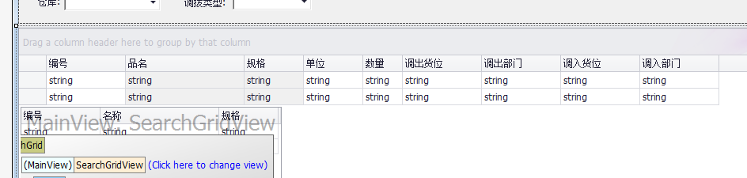
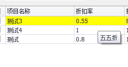
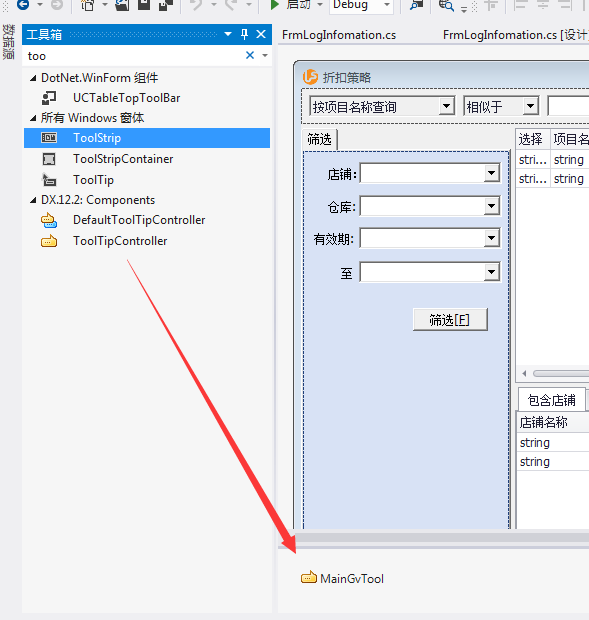
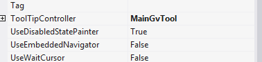

# Grid 用法总结

**1.**屏蔽Grid默认的键盘事件<br />
这里以回车事件为例:
在Grid的ProcessGridKey事件中
```
 private void gcStockAllocation_ProcessGridKey(object sender, KeyEventArgs e)
  {
      GridControl grid = sender as GridControl;
      GridKeyPress(grid.MainView, e);
  }
```
以及一个自定义的方法
```
private void GridKeyPress(BaseView sender, KeyEventArgs e)
  {
      if (e.KeyData == Keys.Enter)
      {
          e.Handled = true;
          return;
      }
  }
```

**2.**删除Grid头部上的GroupBox中写着"Drag Column Header..."的地方<br />
操作方式:<br />
* 1.在Grid上点击Run Designer 进入设计界面
* 2.左上角 选择 Views 视图 找到 OptionsView
* 3.设置 ShowGroupPanel=False<br />


**3.**Grid绑定数据后,状态列显示中文字<br />
在Grid的MainView视图中的CustomColumnDisplayText事件中<br />
```
private void gvTradeList_CustomColumnDisplayText(object sender, DevExpress.XtraGrid.Views.Base.CustomColumnDisplayTextEventArgs e)
 {
  //如果是状态列
  if (e.Column.FieldName == "ttt_TradeStatus")
   {
      //如果状态列的值是5
       if (e.DisplayText == "5")
       {
           e.DisplayText = "打单出库";
       }
   }
 }
```


**4.**绘制单元格颜色<br />
在View的CustomDrawCell时间中<br />
```
private void gvTradeList_CustomDrawCell(object sender, DevExpress.XtraGrid.Views.Base.RowCellCustomDrawEventArgs e)
  {
   if (gvTradeList.GetDataRow(e.RowHandle)["IsFreeze"].ToString() == "True")
   {
     //如果这里不去判断列名称的话即不去判断e.Column.Name，那么就是设置整行的颜色
     e.Appearance.ForeColor = Color.White;
   }
  }
```

绘制单元格颜色跟下面的设置行颜色，本质的区别在于绘制是在Grid加载的时候执行的，所以只执行一次，但是下面的RowStyle方法是一直在<br />
循环执行的,所以在程序执行的过程中Grid绑定的数据改变了,行颜色也会发生变化

**5.**设置行颜色<br />
在View的RowStyle事件中<br />
```
 private void gvTradeList_RowStyle(object sender, DevExpress.XtraGrid.Views.Grid.RowStyleEventArgs e)
  {
   DataRow dr = gvTradeList.GetDataRow(e.RowHandle);
   if (dr == null)
    {
       return;
    }
    if (bool.Parse(dr["IsFreeze"].ToString())==True)
    {
        e.Appearance.ForeColor = Color.Magenta;
    }
  }
```

**6.**行双击事件<br />
行双击事件的话,如果点击在Grid的空白地方也是会触发该事件的,所以要做一些处理
```
 private void gvTradeList_DoubleClick(object sender, EventArgs e)
  {
    MouseEventArgs arg = e as MouseEventArgs;
    if (arg == null)
    {
        return;
    }
    DevExpress.XtraGrid.Views.Grid.ViewInfo.GridHitInfo hInfo = gvTradeList.CalcHitInfo(new Point(arg.X, arg.Y));
    //判断是否左键双击
    if (arg.Button == MouseButtons.Left)
    {
        //判断光标是否在行内、判断光标是否在列内
        if (hInfo.InRow && hInfo.Column != null)
        {
         //DoSomeThing
        }
    }
  }
```

**7.**修改grid的tooltip<br />
先看效果,要实现这一的效果就需要自定tooltip,图中把0.55的折扣率显示成五五折,这一个功能的实现方式，在这里一并说了！！！<br /><br/>
首先.在工具栏找到 **ToolTipController**控件 放到界面中去名字为**MainGvTool**,然后设置**GridControl**的属性ToolTipController=MainGvTool.<br />
<br /><br />
然后.在**MainGvTool**控件的**GetActiveObjectInfo**事件里面写主要代码
```
       private ToolTipControllerShowEventArgs CreateShowArgs(string tooltipText)
       {
           ToolTipControllerShowEventArgs args = MainGvTool.CreateShowArgs();
           args.ToolTip = tooltipText;
           return args;
       }


        private void MainGvTool_GetActiveObjectInfo(object sender, ToolTipControllerGetActiveObjectInfoEventArgs e)
        {
            GridHitInfo hitInfo = gvDiscountSchme.CalcHitInfo(e.ControlMousePosition);

            if (hitInfo.RowHandle < 0 || hitInfo.Column == null||hitInfo.HitTest != GridHitTest.RowCell)
            {
                MainGvTool.HideHint();
                return;
            }

            DataRow row = gvDiscountSchme.GetDataRow(hitInfo.RowHandle);
            if (hitInfo.Column.FieldName == "DiscountRate")
            {
                int rate = (int)(Convert.ToDouble(row["DiscountRate"].ToString()) * 100);
                e.Info = new ToolTipControlInfo("我也不知道这个参数干嘛用的", GetChineseRate(rate));
            }
        }
```

<br />
然而  GetChineseRate（rate）,这个地方就是显示tooltic的提示文本，所以想把0.55显示成五五折，就要从这里动手
<br />

```
//根据数字获取汉字
string GetChineseRate(int intRate)
{
  string chineseRate = string.Empty;

  chineseRate=ChineseRateDic.Where(item => item.Key == intRate).First().Value;
  return chineseRate;
}

//获取1-100数字转换汉字的字典集合
Dictionary<int, string> GetRateDis()
{
  Dictionary<int, string> dic = new Dictionary<int, string>();

  for (int i = 1; i <= 100; i++)
  {
      if (i < 10)
      {
          dic.Add(i, string.Format("零{0}折", Enum.GetName(typeof(NumToChinese), i)));
      }
      else if (i >= 10 && i < 100)
      {
          string tmp = string.Empty;
          foreach (char c in  i.ToString())
          {
              if (c.ToString() == "0") break;
              tmp += Enum.GetName(typeof(NumToChinese), Convert.ToInt32(c.ToString()));
          }
          dic.Add(i, string.Format("{0}折", tmp));
      }
      else
      {
          dic.Add(i,"不打折");
      }
  }
  return dic;
}

//汉字、数字对比枚举
enum NumToChinese
{
  零 = 0,
  一 = 1,
  二 = 2,
  三 = 3,
  四 = 4,
  五 = 5,
  六 = 6,
  七 = 7,
  八 = 8,
  九 = 9
}
```
最后就是在窗体的load事件里面 初始化字典集合就行了
```
 Dictionary<int, string> ChineseRateDic = new Dictionary<int, string>();
 
 /// <summary>
 /// 窗体默认构造函数
 /// </summary>
  public FrmDiscountSchemeList()
  {
   InitializeComponent();
   ChineseRateDic = GetRateDis();
  }
 
```
